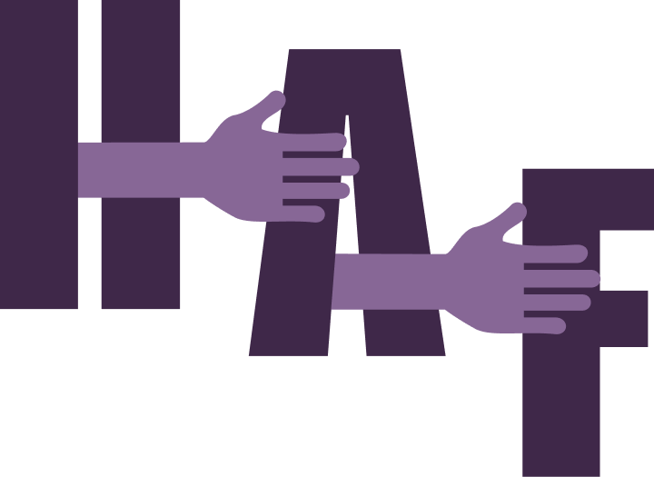

# Help-A-Fren

Help-A-Fren is a solution for direct monetary donations with fair and unbiased distribution practices. In times of disaster, there is a scramble of a large number of people wanting to help. This application aims to solve this problem.

**Problem:** In the building process, we are using the recent Maui Fires as inspiration to inform the direction of our application. Through the first moments of the ordeal, we noticed that part of the initial chaos was there being a large number of people wanting to help (monetarily) without a designated place to direct them to. As well as a desire to cover many bases with a singular donation, especially those with limited funds to give. 

**Objective:** In theory, this application would become the go-to for instances like these. Furthermore, you would only need one activation launch, eliminating the restrictions, fees, and duplication that come with platforms like GoFund Me or Instagram Fundraiser.

**How:** In this project, we mimic DAO governance while applying account abstraction for a simplified user experience. For demo purposes, our backstory is that this is indeed the case throughout the world. Pretending that every community in every county has a designated wallet that is indicated on and easily found on each government website respectively. As the wallets belong to a specific geolocation, DID’s would be used to ensure that only verified members of each community are given the ability to have a say in what and how donation funds are distributed. In this case, we pretend that a Maui official or leader would take up the organizer role. To initiate Help-A-Fren, an organizer must first submit a Plea For Help. Once submitted, any member of the affected community can request aid through the Proposal form. Using Magic, we ensure that only proposals submitted by community members are accepted. To vote, one must login through Magic to verify that they are authorized via geolocation to participate in voting. The voting portal has listed all of the approved and active proposals submitted by community members in need of assistance. It provides a description of why they are requesting help, how they will use the funds they receive, and their requested amount of funds. Voters must select for, against, or to abstain from the proposal. Once a proposal reaches the required voting count threshold, the requested funds will be sent to the address the proposer provided in their request form. Results and statuses of each proposal, as well as the addresses for each transaction can be viewed on the Results page, which can be viewed by anyone in the world. 

and incorporate geolocation

# How it's Made

## Account Abstraction

- [Magic](https://magic.link/) - The developer SDK was used to provide a passwordless authentication and Web3 onboarding. Magic was selected for our app to provide various login methods *(i.e. Email/Social/SMS)* and a feature allowing for Fiat On-Ramps to streamline non-Web3 users to donate with traditional methods. Our project currently only uses Magic's email authentication and as the Web3 signer.

- [Biconomy](https://docs.biconomy.io/) - This account abstraction toolkit was used to apply ERC 4337 solution to our on-chain governance protocol and also allowing any donor a simple user experience eliminating the need for software/hardware wallets. Every user authenticating on the application via the Magic email link will initialize Biconomy's Smart Account platform to generate a smart account for the user. Our application makes use of NFT Voting tokens which are sent to these smart accounts and authenticated for voting. Additionally, Biconomy's paymaster service was applied to sponsor all gas payments for all smart contract interactions.
  - [Creating Proposals](https://github.com/csalvador58/help-a-fren/blob/6abfd56060764173d9831fde0be437c1f4c737e2/app/packages/nextjs/pages/helpafren/haf-proposal-test.tsx) - Proposers are generated a smart account that is linked to their email login when initially signing in during the proposal submittal process. Voters are also generated a smart account in same process.  For voters, an NFT vote token is also minted and sent to the voter's smart account for record tracking purposes.

## Smart Contracts

- [Open Zeppelin Governor v.5.0](https://github.com/csalvador58/help-a-fren/blob/dd328d9ce621ef551198a3870aa57221628a8740/app/packages/hardhat/contracts/HelpAFrenGov.sol) - An OpenZeppelin Governor contract was used follow the industry's best practices on creating an on-chain governance protocol. The recently [released 5.0 version](https://blog.openzeppelin.com/introducing-openzeppelin-contracts-5.0) was used in our project.
  - [Deployed on Polygon Mumbai Testnet](https://mumbai.polygonscan.com/address/0x169732B7AB77575e073C56Ec5493110e2b817108) 
  - Address: ```0x169732B7AB77575e073C56Ec5493110e2b817108```
- [Open Zeppelin ERC721 Token v.5.0](https://github.com/csalvador58/help-a-fren/blob/dd328d9ce621ef551198a3870aa57221628a8740/app/packages/hardhat/contracts/HelpAFrenVoteToken.sol) - Another OpenZeppelin ERC721 contract was used to provide the voting utility for the users. 
  - [Deployed on Polygon Mumbai Testnet](https://mumbai.polygonscan.com/address/0x8B453FFA294F91e4bd1858eDD3cF860A483fF3e4) 
  - [View Help-A-Fren NFT's on OpenSea Testnets](https://testnets.opensea.io/collection/helpafrentoken)
  - Address: ```0x8B453FFA294F91e4bd1858eDD3cF860A483fF3e4```
- [Timelock Controller](https://github.com/csalvador58/help-a-fren/blob/5482880a33309d266cdfc62207cdb466a6a8e66c/app/packages/hardhat/contracts/HelpAFrenTimelock.sol) - A Timelock controller was used with the Governor contract for setting various roles to allow for a decentralized governance.
  - [Deployed on Polygon Mumbai Testnet](https://mumbai.polygonscan.com/address/0x3A9b665684cb31925131FC783b501c7e45b9B04c)
  - Address: ```0x3A9b665684cb31925131FC783b501c7e45b9B04c```
- [Treasury](https://github.com/csalvador58/help-a-fren/blob/6c2791c5b339da8ed709846d3cfdffb79c3fe759/app/packages/hardhat/contracts/HelpAFrenTreasury.sol) - A treasury wallet used to receive donations.  During deployement, the Timelock contract was assigned the owner of the treasury to control withdrawals from the fund based on the successful proposals.
  - [Deployed on Polygon Mumbai Testnet](https://mumbai.polygonscan.com/address/0x522989F0585c4Bc2eb02d27EF8Eb62Ea0ae0C4b1)
  - Address: ```0x522989F0585c4Bc2eb02d27EF8Eb62Ea0ae0C4b1```
- [Proposal Registry](https://github.com/csalvador58/help-a-fren/blob/2db73a65c5b02dbcfe184753fa61608d8c5a2ab2/app/packages/hardhat/contracts/HelpAFrenProposalRegistry.sol) - A registry was used to track the submitted proposal details. Proposal details are uploaded to IPFS  and linked to the proposal details when added to the registry.
  - [Deployed on Polygon Mumbai Testnet](https://mumbai.polygonscan.com/address/0xb842805e618f401fDDd836308234E8fC5231b534)
  - Address: ```0xb842805e618f401fDDd836308234E8fC5231b534```

### Scripts, Testing, and others

- [Deploy Script](app/packages/hardhat/deploy/00_deployContracts.ts) - All smart contracts were deployed using Scaffold-ETH-2. 
- [Testing Script](app/packages/hardhat/test/app_tests.ts) - Smart contract testing performed within the Hardhat environment.
- [Create Proposal and Mint](app/packages/hardhat/scripts/createProposalAndMint.ts) - Additional testing was performed on proposal creations and minting/delegating vote tokens live on Polygon Mumbai Testnet.
- [Scaffold-ETH-2](https://docs.scaffoldeth.io/) - Toolkit used for debugging and testing.
- [Remix](https://remix.ethereum.org/) - Toolkit used for debugging and testing.
- [Pinata](https://www.pinata.cloud/) - Used for IPFS Pinning during NFT Vote token minting and proposal registry.

## Frontend/UI

- [Scaffold-ETH-2](https://docs.scaffoldeth.io/)
- [Next JS](https://nextjs.org/)
- [Daisy UI](https://daisyui.com/)
- [Tailwind](https://tailwindcss.com/)

## Setup

- [Hardhat package env](app/packages/hardhat/.env.example) To use this env template, copy this file, rename it .env, and fill in the values.
- [NextJS package env](app/packages/nextjs/.env.local.example) - To use this env template, copy this file, rename it .env.local, and fill in the values.

```
# Clone repo and install dependencies
cd app
yarn install

# Terminal 1 - Run Scaffold-ETH
cd app
yarn chain

# Terminal 2 - Deploying contracts on Polygon Mumbai Testnet
cd app
yarn deploy

# Terminal 3 - Defaults to http://localhost:3000/
cd app
yarn start

```

